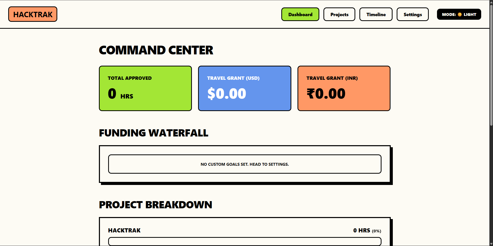
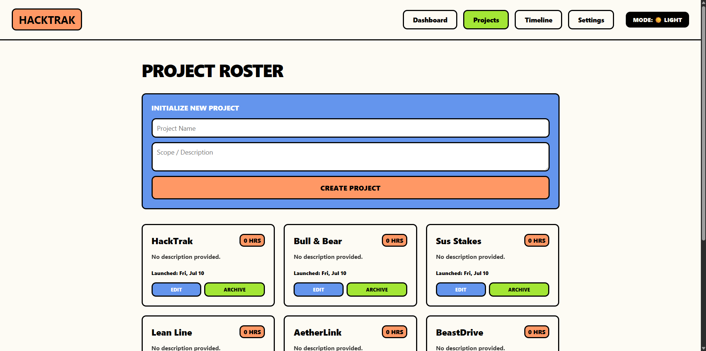
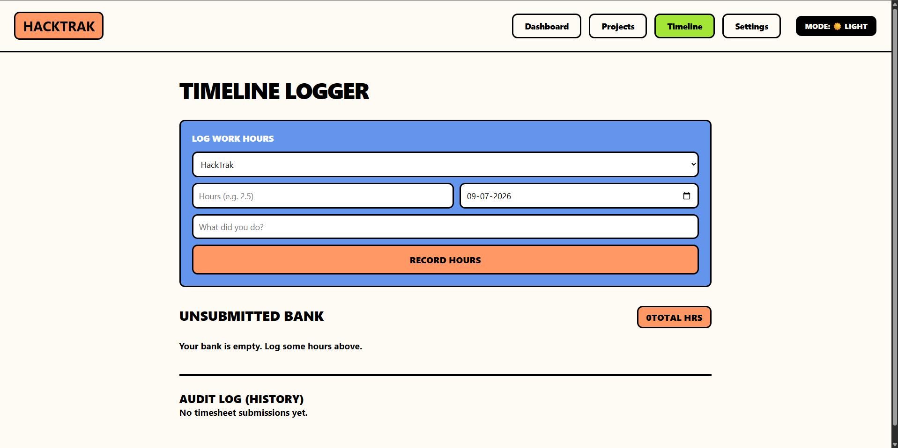
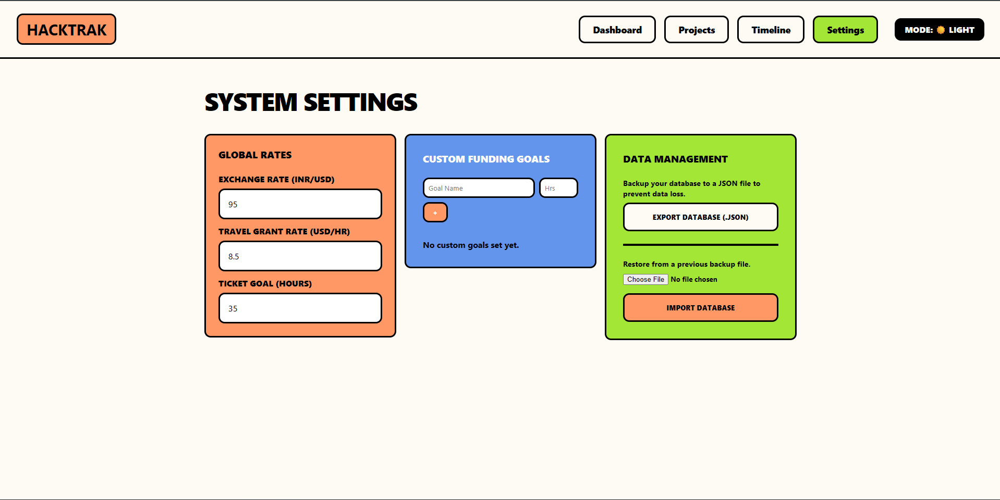

# HackTrak

A fully, local offline tracker, it tracks ur horizons progress basically a tracker with hours and goals u can track how many hours u put on your project and it tells how many reamining to hit the goal and all, i used to do it in claude but i made this simple tool to optimize everythiing

## ScreenShots

## Tech Stack
- Vanilla HTML / CSS / JS
- Zero framework
- Zero build tools
- zero backend as it runs locally 

## How to use it
1. Clone the repository
2. Open The Index.html, if u are in vs code use plugins to start ur localhost server
3. Head to settings to set your exchange rate stipend rate funding goals and all of that stuff
4. Go to Projcets to initialize a new project
5. Use the timeline tab to start logging hours for your active projects
4. check the dashboard to see the math automatically display your hours into % and draw the progress bars and everything

## Usaage of AI
Ai was minorly used in the big block of html in the js file to fix the errors and all, all the freaking commas and semi colons and all and the brackets
